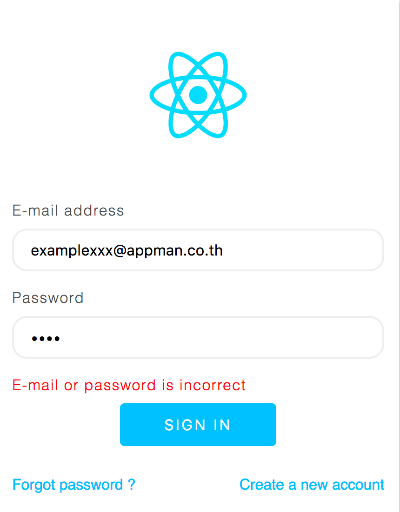

Olufy Tech Internship - Frontend Quest (From Appman)

## Prerequirest

- Node v8+
- Git

## Setup Exam

```
$ git clone https://github.com/olufy-house/olufy-tech-internship-frontend.git
$ cd olufy-tech-internship-frontend
$ npm / yarn install
```

## I. ออกแบบ UI และ Layout


```
$ npm run client / yarn client // open localhost:8080
```

- Label
- Logo
  - ใช้ไฟล์ logo.svg
  - ขนาดกว้าง 180px
- Whiteframe
- Text Input
  - มีขอบโค้ง 1rem
  - เมื่อมีการ Focus จะมีขอบสี #242526
- Button
  - สีของปุ่มใช้สี deepskyblue
  - มีขอบโค้ง 5px
- Tag A
  - เมื่อนำเม้าส์ Hover จะมีเส้นใต้ตัวอักษร
  - ตัวอักษรใช้สี deepskyblue
- Background
  - สีพื้นหลัง ghostwhite

## II. UI Component & Service

Run คำสั่ง

```
$ npm run server / yarn server
```

แก้ไข Code ในข้อ 1 โดยทำการยิง Request ไปที่

[POST] http://localhost:3000/api/login

```json
{
  "email": String,
  "password": String
}
```

\*\*\* email และ password ที่ถูกต้องคือ

```json
{
  "email": "example@olufy.com",
  "password": "password"
}
```

ระหว่างการรอ response จาก server ให้ทำการแสดงถึงการ wating ด้วยการ หมุนโลโก้ react โดยมี class logo-spin เตรียมไว้แล้ว

หากได้รับ http code 200 ให้แสดง Alert และแสดงข้อความว่า Login Successed

หากได้รับ http code 40x ให้แสดงผลลัพท์ดังภาพ

ทุกครั้งที่มีการ submit form ให้ทำการเคลียร์ error label



## หลักการประเมิน (100 คะแนน)

1. ออกแบบ UI & Layout

- วิธีการ render html และการ manipulate DOM (10 คะแนน)
- ความถูกต้องตามโจทย์ (20 คะแนน)
- การเขียน style CSS (20 คะแนน)

2. UI Component & Service

- การใช้งาน react component, state, props (30 คะแนน)
- การเรียกใช้ service และการ handle (20 คะแนน)

3. JS & Unit Test (ไม่ต้องทำก็ได้)

- Pass 5 cases
- Logic
- Code style
